# 详细知识点总结

# 练习题

## 基础篇

### 考点一  函数的概念及表示

1. 函数$y=\frac{\ln(1-x)}{\sqrt{x+1}}+\frac1 x$的定义域是	(　　)

   A.[-1,0)∪(0,1)　　　　B.[-1,0)∪(0,1]

   C.(-1,0)∪(0,1)　　　　D.(-1,0)∪(0,1]

   答案　C

2. 下列各组函数中,$f(x)$,$g(x)$是同一函数的是	(　　)

   A. $f(x)=x^2$,$g(x)=(\sqrt x)^4$

   B. $f(x)=\log_a {x^2}$,$g(x)=2log_a x$

   C. $f(x)=\frac{4^x-1}{2^x-1}$,$g(x)=2^x+1$

   D. $f(x)=\sqrt{x-1}\sqrt{1-x}$,$g(x)=\sqrt{x-1}+\sqrt{1-x}$

   答案　D

### 考点二  分段函数

1. 已知函数*f*(*x*)=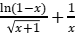则$f(f(-3))$=	(　　)

   A.0　　　　B.1　　　　C.2　　　　D.3

   答案　D

2. 已知函数*f*(*x*)=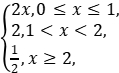则$f(f(f(\frac3 2)))$的值为	(　　)

   A.1　　　　B.2　　　　C.-3　　　　D.$\frac 1 2$

   答案　A

### 考点三   函数的单调性及最值

#### 考向一  判断函数的单调性

1. 下列函数中是增函数的为	(　　)

   A. $f(x)=-x$　　　　B. *f*(*x*)=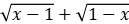

   C. $f(x)=x^2$　　　　D. *f*(*x*)=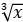

   答案　D

2. 下列函数中,既是偶函数又在(0,+∞)单调递增的函数是	(　　)

   A.$y=x^3$　　　　B.*y*=|*x*|+1

   C.*y*=-*x*2+1　　　　D.*y*=2-|*x*|

   答案　B

#### 考向二  由单调性确定参数的值或取值范围

1. 已知函数*f*(*x*)=lg(*x*2-4*x*-5)在(*a*,+∞)单调递增,则*a*的取值范围是	(　　)

   A.(-∞,-1]　　　　B.(-∞,2]　　　　

   C.[2,+∞)　　　　D.[5,+∞)

   答案　D

2. 已知函数*f*(*x*)=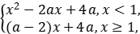若对任意$x_1$,$x_2$∈R,且*x*1≠*x*2,有(*x*1-*x*2)[*f*(*x*1)-*f*(*x*2)]<0成立,则实数a的值是	(　　)

   A.2　　　　B.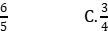　　　　D.1

   答案　D

#### 考向三  由单调性确定函数的值域

1. 函数$f(x)=\frac 1 4 +4x$在[1,2)上的值域是	(　　)

   A.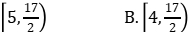　　　　

   C.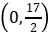　　　　D.[5,+∞)

   答案　A

2. 下列函数中最小值为4的是	(　　)

   A.*y*=*x*2+2*x*+4　　　　B.*y*=|sin *x*|+

   C.*y*=2*x*+22-*x*　　　　D.*y*=ln *x*+

   答案　C

### 考点四  函数的奇偶性

#### 考向一   直接判断函数的奇偶性

1. 设函数$f(x)=\frac {1-x} {1+x}$,则下列函数中为奇函数的是	(　　)

   A. $f(x-1)-1$　　　　B. $f(x-1)+1$

   C. $f(x+1)-1$　　　　D. $f(x+1)+1$

   答案　B

2. 设函数$f(x)=x^3-\frac 1 {x^3}$,则$f(x)$(　　)

   A.是奇函数,且在(0,+∞)单调递增

   B.是奇函数,且在(0,+∞)单调递减

   C.是偶函数,且在(0,+∞)单调递增

   D.是偶函数,且在(0,+∞)单调递减

   答案　A

#### 考向二  利用奇偶性求参数值

1. 已知函数$f(x)=x^3\cdot(a\cdot2^x-2^{-x})$是偶函数,则a=　　　　*.* 

   答案　1

2. 设函数$f(x)=e^x+ae^{-x}$(a为常数).若$f(x)$为奇函数,则a=　　　　;若$f(x)$是R上的增函数,则a的取值范围是　　　　*.* 

   答案　-1　(-∞,0]

#### 考向三  利用奇偶性求解析式或函数值

1. 已知函数*f*(*x*)=*ax*3+*b*sin *x*+cos *x*(*a*,*b*∈R),若$f(\frac \pi 3)$,则$f(-\frac \pi 3)$=	(　　)

   A.-1　　　　B.0　　　　C.1　　　　D.2

   答案　B

2. 已知函数*f*(*x*)=ln(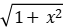-*x*)+1, $f(a)=2$,则$f(-a)$=　　　*.* 

   答案　0

### 考点五  函数的周期性

1. 已知$f(x)$是定义在R上的偶函数,且$f(x+4)=f(x-2)$.若当x∈[-3,0]时, $f(x)=6-x$,则$f(919)$=　　　　*.* 

   答案　6

2. 函数$f(x)$满足$f(x+4)=f(x)$(x∈R),且在区间(-2,2]上, *f*(*x*)=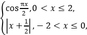 则$f(f(15))$的值为　　　　*.* 

   答案　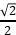

## 综合篇

### 考法一  函数定义域的求法

#### 考向一  已知函数解析式求定义域

1. 函数*y*=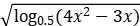的定义域为	(　　)

   A.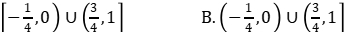

   C.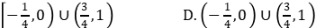

   答案　A

2. 函数$f(x)=\frac {\sqrt{2^x - 1}} {\mid x \mid - 1}$的定义域为　　　　　　　　*.* 

   答案　[0,1)∪(1,+∞)

#### 考向二  求抽象函数的定义域

1. 已知函数$f(x)$的定义域为[3,6],则函数的$y=f(2x)+\lg(2-x)$定义域为	(　　)

   A.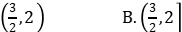

   C.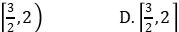

   答案　C

2. 若函数$f(x^2+1)$的定义域为[-1,1],则$f(\lg x)$的定义域为　　　　*.* 

   答案　[10,100]

### 考法二  函数解析式的求法

#### 考向一  利用待定系数法求函数解析式

1. 已知幂函数$y=f(x)$的图象经过点$(2,\sqrt 2)$,则$f(\frac 1 2)$=	(　　)

   A.2　　　　B.$\sqrt 2$　　　　C.$\frac {\sqrt 2} 2$　　　　D.$\frac 1 2$

   答案　C

2. 已知二次函数$f(x)$,其图象过点(1,-1),且满足,$f(x+2)=f(x)+4x+4$则$f(x)$的解析式为　　　　*.* 

   答案　$f(x)=x^2-2$

#### 考向二  利用方程思想求解析式

1. 函数$f(x)$对$x\neq0$的一切实数均有*f*(*x*)+2*f*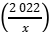=3*x*,则$f(2022)$等于	(　　)

   A.2 020　　　　B.-2 020　　　　C.-2 021　　　　D.2 021

   答案　B

2. 已知3*f*(*x*)+5*f*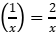+1,则函数$f(x)$的解析式为　　　　　　　　　*.* 

   答案　*f*(*x*)=-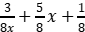

### 考法三  分段函数问题的解题策略

#### 考向一  分段函数单调性问题

1. 已知函数*f*(*x*)=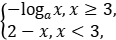则“函数$f(x)$在R上单调递减”是“$a>1$”的	(　　)

   A.充分不必要条件

   B.必要不充分条件

   C.充要条件

   D.既不充分也不必要条件

   答案　A

2. 若函数*f*(*x*)=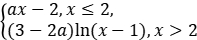在R上单调递增,则实数a的取值范围是	(　　)

   A.(0,1]　　　　B.(0,2]

   C.$(0,\frac 3 2)$　　　　D.$[2,+\infty)$

   答案　A

#### 考向二  分段函数与不等式结合问题

1. 设函数*f*(*x*)=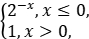则满足$f(x+1)<f(2x)$的x的取值范围是	(　　)

   A.(-∞,-1]　　　　B.(0,+∞)

   C.(-1,0)　　　　D.(-∞,0)

   答案　D

2. 设函数*f*(*x*)=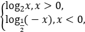若$f(a)>f(-a)$,则实数a的取值范围是	(　　)

   A.(-1,0)∪(0,1)　　　　

   B.(-∞,-1)∪(1,+∞)

   C.(-1,0)∪(1,+∞)　　　　

   D.(-∞,-1)∪(0,1)

   答案　C

### 考法四  函数单调性的判断及应用

#### 考向一  求函数单调区间

1. 函数$f(x)=\mid x^2-3x+2 \mid$的单调递增区间是	(　　)

   A.$[\frac 3 2,+\infty]$

   B.$[1,\frac 3 2]$和[2,+∞)

   C.(-∞,1]和$[\frac 3 2,2]$

   D.$(-\infty,\frac 3 2)$和[2,+∞)

   答案　B

2. 函数$f(x)=\ln(x^2-2x-8)$的单调递增区间是(　　)

   A.(-∞,-2)　　　　B.(-∞,1)　　　　

   C.(1,+∞)　　　　D.(4,+∞)

   答案　D

#### 考向二  由单调性解不等式及比较大小

1. 函数$f(x)$在(-∞,+∞)单调递减,且为奇函数.若,$f(1)=-1$则满足$-1\leq f(x-2)\leq1$的$x$的取值范围是	(　　)

   A.[-2,2]　　　　B.[-1,1]

   C.[0,4]　　　　D.[1,3]

   答案　D

2. 正实数a,b,c满足$a+\sin a = 0$,$b+3^b=3$,$c+\log_4 c=4$,则实数a,b,c之间的大小关系为	(　　)

   A.b<a<c　　　　B.a<b<c

   C.a<c<b　　　　D.b<c<a

   答案　A

### 考法五  函数奇偶性的判断及应用

#### 考向一  函数的单调性与奇偶性综合

1. 下列函数中,既是奇函数,又在(0,+∞)上单调递增的是(　　)

   A.$y=\ln \mid x-1 \mid$　　　　B.$y=x-\frac 1 x$

   C.$y=\frac {\cos x} x$　　　　D.$y=x^3 - 3x$

   答案　B

2. 若定义在R的奇函数$f(x)$在(-∞,0)单调递减,且,$f(2)=0$则满足$xf(x-1)\geq0$的x的取值范围是	(　　)

   A.[-1,1]∪[3,+∞)　　　　B.[-3,-1]∪[0,1]

   C.[-1,0]∪[1,+∞)　　　　D.[-1,0]∪[1,3]

   答案　D

#### 考向二  函数的奇偶性与对称性相结合

1. 设函数$f(x)$的定义域为R,且$f(x+2)$为偶函数, $f(2x+1)$为奇函数,则	(　　)

   A. $f(-\frac 1 2) = 0$　　　　B. $f(-1)=0$

   C. $f(2)=0$　　　　D. $f(4)=0$

   答案　B

2. 已知函数$f(x)$是定义在R上的奇函数,函数的$g(x)=\mid x-2 \mid f(x)$图象关于直线对$x=2$称,若$f(-1)=-1$,则$g(3)=$	(　　)

   A.5　　　　B.1　　　　C.-1　　　　D.-5

   答案　B

### 考法六  函数周期性的判断及应用

#### 考向一  由奇偶性、对称性确定函数周期

1. 设$f(x)$是定义域为R的奇函数,且若$f(1+x)=f(-x)$.$f(-\frac 1 3)=-\frac 1 3$,则=$f(\frac 5 3)$(　　)

   A.-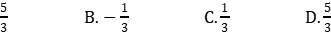

   答案　C

2. 已知函数$f(x)$,$g(x)$的定义域均为R,且$f(x)+g(2-x)=5$,$g(x)-f(x-4)=7$.若的图$y=g(x)$象关于直线对称$x=2$,$g(2)=4$,则$\sum_{k=1}^{22} f(k)$=	(　　)

   A.-21　　　　B.-22　　　　C.-23　　　　D.-24

   答案　D

#### 考向二  周期性与单调性、奇偶性综合问题

1. 定义域为R的偶函数$f(x)$,满足$f(0)=-1$.设$g(x)=(x-1)\cdot f(x)$,若$g(x+1)$是偶函数,则$g(2022)$=	(　　)

   A.-2 022　　　　B.-2 021　　　　C.2 021　　　　D.2 022

   答案　C

2. 已知$f(x)$是R上的奇函数, $f(1+x)=f(1-x)$,当$x_1$,$x_2$∈[0,1],且$x_1\neq x_2$时,$\frac {f(x_1)-f(x_2)} {x_1-x_2}>0$,则当$-3\leq x \leq1$时,不等式的$xf(x)>0$解集为(　　)

   A.[-1,0)∪(0,1]　　　　B.[-3,-2)∪(0,1]　　　　

   C.(-2,-1)∪(0,1]　　　　D.(-2,0)∪(0,1]

   答案　D