# 详细知识点总结

# 练习题

## 基础篇

### 考点一  函数的概念及表示

1. 函数$y=\frac{\ln(1-x)}{\sqrt{x+1}}+\frac1 x$的定义域是	(　　)

   A.[-1,0)∪(0,1)　　　　B.[-1,0)∪(0,1]

   C.(-1,0)∪(0,1)　　　　D.(-1,0)∪(0,1]

   答案　C

2. 下列各组函数中,$f(x)$,$g(x)$是同一函数的是	(　　)

   A. $f(x)=x^2$,$g(x)=(\sqrt x)^4$

   B. $f(x)=\log_a {x^2}$,$g(x)=2log_a x$

   C. $f(x)=\frac{4^x-1}{2^x-1}$,$g(x)=2^x+1$

   D. $f(x)=\sqrt{x-1}\sqrt{1-x}$,$g(x)=\sqrt{x-1}+\sqrt{1-x}$

   答案　D

### 考点二  分段函数

1*.*(2022福建厦门模拟,3)已知函数*f*(*x*)=则*f*(*f*(-3))=	(　　)

A.0　　　　B.1　　　　C.2　　　　D.3

答案　D

2*.*(2022广东广雅中学月考,5)已知函数*f*(*x*)=则*f*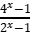的值为	(　　)

A.1　　　　B.2　　　　C.-3　　　　D.

答案　A

### 考点三   函数的单调性及最值

#### 考向一  判断函数的单调性

1*.*(2021全国甲文,4,5分)下列函数中是增函数的为	(　　)

A. *f*(*x*)=-*x*　　　　B. *f*(*x*)=

C. *f*(*x*)=*x*2　　　　D. *f*(*x*)=

答案　D

3*.*(2011课标文,3,5分)下列函数中,既是偶函数又在(0,+∞)单调递增的函数是	(　　)

A.*y*=*x*3　　　　B.*y*=|*x*|+1

C.*y*=-*x*2+1　　　　D.*y*=2-|*x*|

答案　B

#### 考向二  由单调性确定参数的值或取值范围

已知函数*f*(*x*)=lg(*x*2-4*x*-5)在(*a*,+∞)单调递增,则*a*的取值范围是	(　　)

A.(-∞,-1]　　　　B.(-∞,2]　　　　

C.[2,+∞)　　　　D.[5,+∞)

答案　D

已知函数*f*(*x*)=若对任意*x*1,*x*2∈***\*R\****,且*x*1≠*x*2,有(*x*1-*x*2)[*f*(*x*1)-*f*(*x*2)]<0成立,则实数*a*的值是	(　　)

A.2　　　　B.　　　　D.1

答案　D

#### 考向三  由单调性确定函数的值域

函数*f*(*x*)=+4*x*在[1,2)上的值域是	(　　)

A.　　　　

C.　　　　D.[5,+∞)

答案　A

下列函数中最小值为4的是	(　　)

A.*y*=*x*2+2*x*+4　　　　B.*y*=|sin *x*|+

C.*y*=2*x*+22-*x*　　　　D.*y*=ln *x*+

答案　C

### 考点四  函数的奇偶性

#### 考向一   直接判断函数的奇偶性

设函数*f*(*x*)=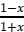,则下列函数中为奇函数的是	(　　)

A. *f*(*x*-1)-1　　　　B. *f*(*x*-1)+1

C. *f*(*x*+1)-1　　　　D. *f*(*x*+1)+1

答案　B

设函数*f*(*x*)=*x*3-,则*f*(*x*)(　　)

A.是奇函数,且在(0,+∞)单调递增　　　　

B.是奇函数,且在(0,+∞)单调递减

C.是偶函数,且在(0,+∞)单调递增　　　　

D.是偶函数,且在(0,+∞)单调递减

答案　A

#### 考向二  利用奇偶性求参数值

已知函数*f*(*x*)=*x*3·(*a*·2*x*-2-*x*)是偶函数,则*a*=　　　　*.* 

答案　1

设函数*f*(*x*)=e*x*+*a*e-*x*(*a*为常数)*.*若*f*(*x*)为奇函数,则*a*=　　　　;若*f*(*x*)是R上的增函数,则*a*的取值范围是　　　　*.* 

答案　-1　(-∞,0]

#### 考向三  利用奇偶性求解析式或函数值

已知函数*f*(*x*)=*ax*3+*b*sin *x*+cos *x*(*a*,*b*∈R),若*f*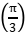=1,则*f*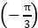=	(　　)

A.-1　　　　B.0　　　　C.1　　　　D.2

答案　B

已知函数*f*(*x*)=ln(-*x*)+1, *f*(*a*)=2,则*f*(-*a*)=　　　*.* 

答案　0

### 考点五  函数的周期性

已知*f*(*x*)是定义在R上的偶函数,且*f*(*x*+4)=*f*(*x*-2)*.*若当*x*∈[-3,0]时, *f*(*x*)=6-*x*,则*f*(919)=　　　　*.* 

答案　6

函数*f*(*x*)满足*f*(*x*+4)=*f*(*x*)(*x*∈R),且在区间(-2,2]上, *f*(*x*)= 则*f*(*f*(15))的值为　　　　*.* 

答案　

## 综合篇

### 考法一  函数定义域的求法

#### 考向一  已知函数解析式求定义域

函数*y*=的定义域为	(　　)

A.

C.

答案　A

函数*f*(*x*)=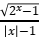的定义域为　　　　　　　　*.* 

答案　[0,1)∪(1,+∞)

#### 考向二  求抽象函数的定义域

已知函数*f*(*x*)的定义域为[3,6],则函数*y*=*f*(2*x*)+lg(2-*x*)的定义域为	(　　)

A.

C.

答案　C

若函数*f*(*x*2+1)的定义域为[-1,1],则*f*(lg *x*)的定义域为　　　　*.* 

答案　[10,100]

### 考法二  函数解析式的求法

#### 考向一  利用待定系数法求函数解析式

已知幂函数*y*=*f*(*x*)的图象经过点(2,),则*f*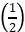=	(　　)

A.2　　　　B.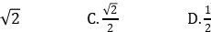

答案　C

已知二次函数*f*(*x*),其图象过点(1,-1),且满足*f*(*x*+2)=*f*(*x*)+4*x*+4,则*f*(*x*)的解析式为　　　　*.* 

答案　*f*(*x*)=*x*2-2

#### 考向二  利用方程思想求解析式

\1. 函数*f*(*x*)对*x*≠0的一切实数均有*f*(*x*)+2*f*=3*x*,

则*f*(2 022)等于	(　　)

A.2 020　　　　B.-2 020　　　　C.-2 021　　　　D.2 021

答案　B

已知3*f*(*x*)+5*f*+1,则函数*f*(*x*)的解析式为　　　　　　　　　*.* 

答案　*f*(*x*)=-

### 考法三  分段函数问题的解题策略

#### 考向一  分段函数单调性问题

已知函数*f*(*x*)=则“函数*f*(*x*)在R上单调递减”是“*a*>1”的	(　　)

A.充分不必要条件

B.必要不充分条件

C.充要条件

D.既不充分也不必要条件

答案　A

若函数*f*(*x*)=在R上单调递增,则实数*a*的取值范围是	(　　)

A.(0,1]　　　　B.(0,2]

C.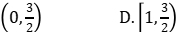

答案　A

#### 考向二  分段函数与不等式结合问题

设函数*f*(*x*)=则满足*f*(*x*+1)<*f*(2*x*)的*x*的取值范围是	(　　)

A.(-∞,-1]　　　　B.(0,+∞)

C.(-1,0)　　　　D.(-∞,0)

答案　D

设函数*f*(*x*)=若*f*(*a*)>*f*(-*a*),则实数*a*的取值范围是	(　　)

A.(-1,0)∪(0,1)　　　　

B.(-∞,-1)∪(1,+∞)

C.(-1,0)∪(1,+∞)　　　　

D.(-∞,-1)∪(0,1)

答案　C

### 考法四  函数单调性的判断及应用

#### 考向一  求函数单调区间

函数*f*(*x*)=|*x*2-3*x*+2|的单调递增区间是	(　　)

A.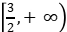

B.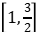和[2,+∞)

C.(-∞,1]和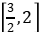

D.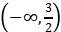和[2,+∞)

答案　B

函数*f*(*x*)=ln(*x*2-2*x*-8)的单调递增区间是(　　)

A.(-∞,-2)　　　　B.(-∞,1)　　　　

C.(1,+∞)　　　　D.(4,+∞)

答案　D

#### 考向二  由单调性解不等式及比较大小

函数*f*(*x*)在(-∞,+∞)单调递减,且为奇函数*.*若*f*(1)=-1,则满足-1≤*f*(*x*-2)≤1的*x*的取值范围是	(　　)

A.[-2,2]　　　　B.[-1,1]

C.[0,4]　　　　D.[1,3]

答案　D

正实数*a*,*b*,*c*满足*a*+sin *a*=2,*b*+3*b*=3,*c*+log4*c*=4,则实数*a*,*b*,*c*之间的大小关系为	(　　)

A.*b*<*a*<*c*　　　　B.*a*<*b*<*c*

C.*a*<*c*<*b*　　　　D.*b*<*c*<*a*

答案　A

### 考法五  函数奇偶性的判断及应用

#### 考向一  函数的单调性与奇偶性综合

下列函数中,既是奇函数,又在(0,+∞)上单调递增的是(　　)

A.*y*=ln|*x*-1|　　　　B.*y*=*x*-

C.*y*=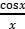　　　　D.*y*=*x*3-3*x*

答案　B

若定义在R的奇函数*f*(*x*)在(-∞,0)单调递减,且*f*(2)=0,则满足*xf*(*x*-1)≥0的*x*的取值范围是	(　　)

A.[-1,1]∪[3,+∞)　　　　B.[-3,-1]∪[0,1]

C.[-1,0]∪[1,+∞)　　　　D.[-1,0]∪[1,3]

答案　D

#### 考向二  函数的奇偶性与对称性相结合

设函数*f*(*x*)的定义域为R,且*f*(*x*+2)为偶函数, *f*(2*x*+1)为奇函数,则	(　　)

A. *f* 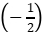=0　　　　B. *f*(-1)=0

C. *f*(2)=0　　　　D. *f*(4)=0

答案　B

已知函数*f*(*x*)是定义在R上的奇函数,函数*g*(*x*)=|*x*-2|*f*(*x*)的图象关于直线*x*=2对称,若*f*(-1)=-1,则*g*(3)=	(　　)

A.5　　　　B.1　　　　C.-1　　　　D.-5

答案　B

### 考法六  函数周期性的判断及应用

#### 考向一  由奇偶性、对称性确定函数周期

设*f*(*x*)是定义域为R的奇函数,且*f*(1+*x*)=*f*(-*x*)*.*若*f*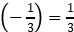,则*f*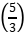=	(　　)

A.-

答案　C

已知函数*f*(*x*),*g*(*x*)的定义域均为R,且*f*(*x*)+*g*(2-*x*)=5,*g*(*x*)-*f*(*x*-4)=7*.*若*y*=*g*(*x*)的图象关于直线*x*=2对称,*g*(2)=4,则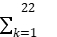*f*(*k*)=	(　　)

A.-21　　　　B.-22　　　　C.-23　　　　D.-24

答案　D

#### 考向二  周期性与单调性、奇偶性综合问题

定义域为R的偶函数*f*(*x*),满足*f*(0)=-1*.*设*g*(*x*)=(*x*-1)·*f*(*x*),若*g*(*x*+1)是偶函数,则*g*(2 022)=	(　　)

A.-2 022　　　　B.-2 021　　　　C.2 021　　　　D.2 022

答案　C

已知*f*(*x*)是R上的奇函数, *f*(1+*x*)=*f*(1-*x*),当*x*1,*x*2∈[0,1],且*x*1≠*x*2时,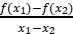>0,则当-3≤*x*≤1时,不等式*xf*(*x*)>0的解集为(　　)

A.[-1,0)∪(0,1]　　　　B.[-3,-2)∪(0,1]　　　　

C.(-2,-1)∪(0,1]　　　　D.(-2,0)∪(0,1]

答案　D